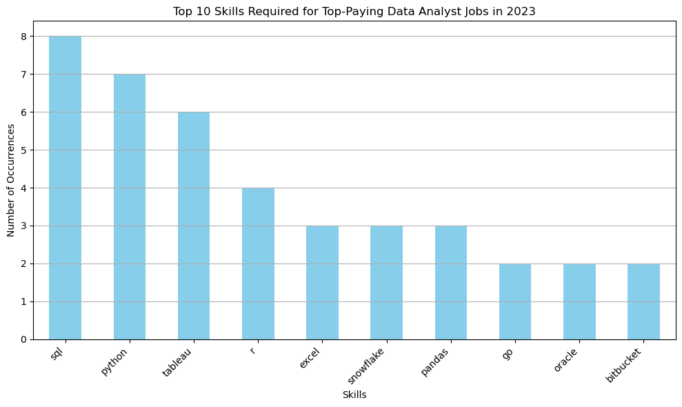
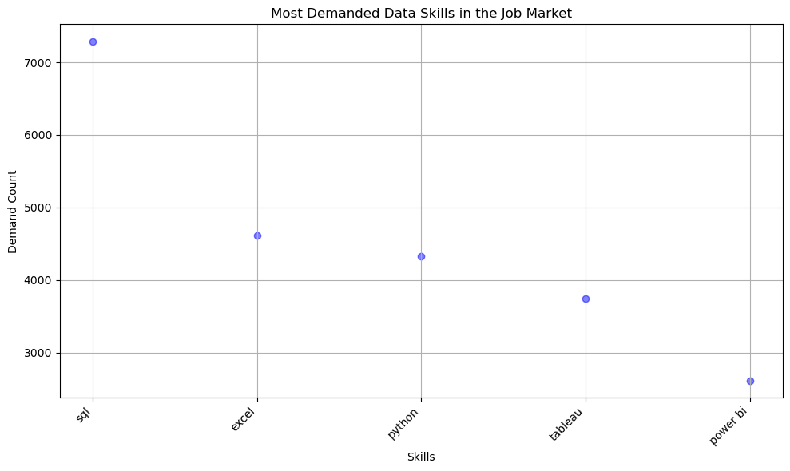
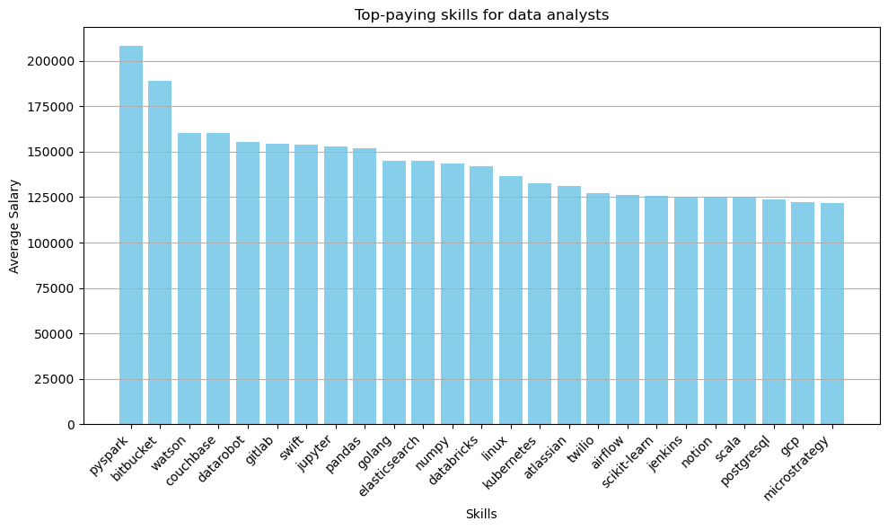
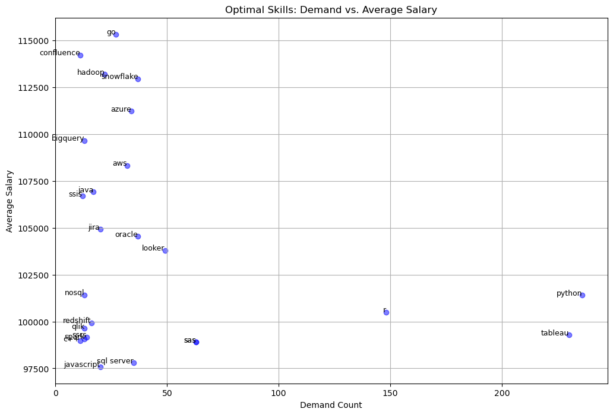

# SQL_Project_Data_Job_Analysis

# Introduction
Let's sail into the uncharted waters of data jobs. In this project, I'm diving into data job postings from 2023 to discover hidden treasures of top-paying jobs, in-demand skills, and where high demand meets high salary in data analytics.
# Background
Being a newbie to the data job market, especially after a career change, may be hard. Which skills should I learn first? Which skills are most likely to get me a remote job? What are the top-paid skills? In order to navigate the data job market more effectively, this project explores job postings to find optimal future job details like salaries, skills, and additional options (work from home, health insurance, etc.).

Data source: [Luke Barousse SQL Course](https://www.lukebarousse.com/sql)

### **Questions I wanted to answer through this project:**
**1. What are the top-paying data analyst jobs?**
- What are the top-paying jobs for my role?
- Identify the top 10 highest-paying Data Analyst jobs that are available remotely.

**2. What skills are required for these top-paying jobs?**
- Provide a detailed look at which high-paying jobs demand certain skills, helping job seekers understand which skills to develop that align with top salaries.

**3. What skills are the most in demand for data analysts?**
- Display the top 5 skills by their demand in remote jobs

**4. Which skills are associated with higher salaries?**
- Identify the most financially rewarding skills to acquire or improve

**5. What are the most optimal skills to learn?**
- Target skills that offer job security (high demand) and financial benefits (high salaries)
- Concentrate on remote positions

# Tools I Used

For my plunge into the data analyst job market, I navigated the currents using several key tools:
- SQL
- PostgreSQL
- VS Code
- GitHub
- Pandas and Matplotlib for visualisation in Python

# The Analysis

Each query for this project was like setting sail to explore specific aspects of the data analyst job market. Here's how I charted a course for each question.

### 1. Top Paying Data Analyst Jobs
In order to find the top paying jobs, I wrote a query to filter top 10 data analyst jobs by average yearly salary and location, with an emphasis on remote opportunities. This query showcases the lucrative positions in the field.

```sql
SELECT
    job_id,
    job_title,
    job_location,
    job_schedule_type,
    salary_year_avg,
    job_posted_date,
    company_dim.name as company_name
FROM 
    job_postings_fact
LEFT JOIN company_dim ON company_dim.company_id = job_postings_fact.company_id
WHERE job_title_short = 'Data Analyst' AND job_location = 'Anywhere'
AND salary_year_avg IS NOT NULL
ORDER BY salary_year_avg DESC
LIMIT 10
```
### Salary Range (in the top 10)
- Highest: $650,000
- Lowest: $217,000
- Average: ~$338,950
### Companies Hiring
- Mantys - Data Analyst: $650,000
- Meta - Director of Analytics: $336,500
- AT&T - Associate Director - Data Insights: $255,829.50
- Pinterest - Data Analyst, Marketing: $232,423
- Uclahealthcareers - Data Analyst (Hybrid/Remote): $217,000

### 2. Skills for Top Paying Jobs
To identify the skills needed for the highest-paying jobs, I joined job postings with skills data, revealing what employers prioritize for well-compensated positions.

```sql
WITH top_paying_jobs AS (
    SELECT
        job_id,
        job_title,
        salary_year_avg,
        company_dim.name as company_name
    FROM 
        job_postings_fact
    LEFT JOIN company_dim ON company_dim.company_id = job_postings_fact.company_id
    WHERE job_title_short = 'Data Analyst' AND job_location = 'Anywhere'
    AND salary_year_avg IS NOT NULL
    ORDER BY salary_year_avg DESC
    LIMIT 10
)

SELECT
    top_paying_jobs.*,
    skills
FROM top_paying_jobs
INNER JOIN skills_job_dim ON top_paying_jobs.job_id = skills_job_dim.job_id
INNER JOIN skills_dim ON skills_job_dim.skill_id = skills_dim.skill_id
ORDER BY
    salary_year_avg DESC
```


[Chart generated in Python](https://github.com/girlgonedata/SQL_Project_Data_Job_Analysis/blob/main/2_top_paying_roles_skills.py)

### Here are the top 10 most common skills required for the top-paid data analyst roles in 2023 based on the job postings:

- SQL - 8 occurrences
- Python - 7 occurrences
- Tableau - 6 occurrences
- R - 4 occurrences
- Excel - 3 occurrences
- Snowflake - 3 occurrences
- Pandas - 3 occurrences
- Go - 2 occurrences
- Oracle - 2 occurrences
- Bitbucket - 2 occurrences


### Insights
SQL is the most commonly required skill, highlighting its importance in data analysis roles.
Python and Tableau are also highly sought after, indicating a strong preference for programming and data visualization skills.
Traditional tools like Excel remain relevant.
Modern data platforms and libraries such as Snowflake and Pandas are also in demand.
The presence of skills like Go and Bitbucket suggests a need for software development and version control knowledge in some data analyst roles.

### 3. In-Demand Skills for Data Analysts
This query pinpoints the most frequently requested skills in job postings, helping to find the most demanded ones.

```sql
SELECT 
    skills,
    COUNT(skills_job_dim.job_id) AS demand_count
FROM job_postings_fact
INNER JOIN skills_job_dim ON job_postings_fact.job_id = skills_job_dim.job_id
INNER JOIN skills_dim ON skills_job_dim.skill_id = skills_dim.skill_id
WHERE job_title_short = 'Data Analyst' AND job_work_from_home = TRUE
GROUP BY skills
ORDER BY demand_count DESC
LIMIT 5
```

[Chart generated in Python](https://github.com/girlgonedata/SQL_Project_Data_Job_Analysis/blob/main/3_top_demanded_skills.py)


### Insights
1. **SQL (7,291 requests):** SQL tops the list by a significant margin. This indicates a high demand for skills related to database management, querying, and data manipulation. SQL’s dominance suggests that roles involving data analysis, database administration, and business intelligence heavily rely on this skill.

2. **Excel (4,611 requests):** Excel is also in high demand, reflecting its continued importance for data analysis, reporting, and financial modeling. While not as specialized as SQL, Excel remains a fundamental tool for many business and administrative roles.

2. **Python (4,330 requests):** Python is a strong contender, highlighting its growing role in data science, machine learning, and automation. Python's versatility makes it valuable across various fields, including software development and data analysis.

4. **Tableau (3,745 requests):** Tableau’s presence indicates a solid demand for skills in data visualization and business intelligence. This suggests that many organizations are looking for professionals who can create interactive and insightful dashboards to support data-driven decisions.

5. **Power BI (2,609 requests):** Power BI, like Tableau, is a key tool for business intelligence and data visualization. Although it has a lower demand compared to Tableau, its significant number of requests indicates that it's also a valuable skill in the data analytics landscape.

### Key Takeaways:
Data-related Skills: SQL, Python, and Excel are all strongly represented, underscoring the high demand for data management, analysis, and visualization skills.
Business Intelligence Tools: Both Tableau and Power BI are in demand, reflecting the importance of data visualization tools in interpreting and presenting data effectively.
Skill Versatility: Python stands out for its versatility, being relevant across various fields from data science to software development.
Overall, proficiency in SQL, Excel, and Python, along with experience in data visualization tools like Tableau and Power BI, appears to be highly valued in the current job market.

### 4. Skills Based On Salary
In previous section I searched for the most frequently mentioned skills in job postings. Now I'm going to breakdown the top-paid ones, exploring the average salaries associated with different skills.

```sql
SELECT 
    skills,
    ROUND(AVG(salary_year_avg), 0) as avg_salary
FROM job_postings_fact
INNER JOIN skills_job_dim ON job_postings_fact.job_id = skills_job_dim.job_id
INNER JOIN skills_dim ON skills_job_dim.skill_id = skills_dim.skill_id
WHERE job_title_short = 'Data Analyst' AND salary_year_avg IS NOT NULL
AND job_work_from_home = TRUE
GROUP BY skills
ORDER BY avg_salary DESC
LIMIT 25
```

[Chart generated in Python](https://github.com/girlgonedata/SQL_Project_Data_Job_Analysis/blob/main/4_top_paying_skills.py)

Here are some quick insights into the trends for the top-paying skills for data analysts based on the provided data:

- High demand for Big Data &ML Skills
- Software Development & Deloyment Proficiency
- Cloud Computing Expertise

### Insights:

1. **High Salaries for Specialized Skills**:
   - **PySpark** leads with an average salary of \$208,172, indicating high demand for big data processing skills.
   - Other high-paying specialized skills include **Bitbucket** (\$189,155) and **Watson** (\$160,515), showing a trend towards high remuneration for expertise in specific tools and platforms.

2. **Data Science and Machine Learning Tools**:
   - Skills related to data science and machine learning, such as **Pandas** (\$151,821), **Jupyter** (\$152,777), and **Scikit-learn** (\$125,781), are highly valued.
   - Tools like **DataRobot** (\$155,486) and **Databricks** (\$141,907) emphasize the importance of machine learning and data engineering platforms.

3. **Programming and Scripting Languages**:
   - **Swift** (\$153,750) and **Golang** (\$145,000) are among the top-paying programming languages, showing a preference for languages used in data processing and analysis.
   - **Scala** (\$124,903) and **PostgreSQL** (\$123,879) also feature prominently, indicating the value of these languages in handling large datasets and databases.

4. **DevOps and Data Management Tools**:
   - Skills like **GitLab** (\$154,500), **Elasticsearch** (\$145,000), and **Kubernetes** (\$132,500) highlight the importance of DevOps and data management in the data analyst role.
   - **Airflow** (\$126,103) and **Jenkins** (\$125,436) further emphasize the trend towards automation and workflow management.

5. **Cloud and Infrastructure**:
   - **GCP** (\$122,500) indicates a significant demand for cloud platform skills, reflecting the industry's shift towards cloud computing for data storage and analysis.
   - **Linux** (\$136,508) underscores the importance of operating system proficiency in managing data infrastructure.

6. **Visualization and Reporting Tools**:
   - **MicroStrategy** (\$121,619) and **Notion** (\$125,000) are valued for their ability to create and manage data visualizations and reports.

### Key Takeaways:

The top-paying skills for data analysts in 2023 show a clear trend towards high remuneration for specialized and advanced technical skills. Proficiency in big data processing, machine learning, and data science tools is highly valued, along with strong programming and DevOps capabilities. Cloud platform knowledge and expertise in data management and visualization tools also contribute significantly to higher salaries.

These insights can help guide data analysts in focusing their skill development to align with industry demands and achieve higher-paying roles.

### 5. The Most Optimal Skills to Learn
Let's merge insights on the most sought-after and highest-paying skills to identify which ones offer job security (high demand) and financial benefits (high salaries), providing strategic insights for career development in data analysis.

```sql
WITH skills_demand as (
    SELECT 
        skills_dim.skill_id,
        skills_dim.skills,
        COUNT(skills_job_dim.job_id) AS demand_count
    FROM job_postings_fact
    INNER JOIN skills_job_dim ON job_postings_fact.job_id = skills_job_dim.job_id
    INNER JOIN skills_dim ON skills_job_dim.skill_id = skills_dim.skill_id
    WHERE job_title_short = 'Data Analyst' AND salary_year_avg IS NOT NULL
    AND job_work_from_home = TRUE
    GROUP BY skills_dim.skill_id
)

, average_salary as (
    SELECT
        skills_job_dim.skill_id,
        ROUND(AVG(salary_year_avg), 0) as avg_salary
    FROM job_postings_fact
    INNER JOIN skills_job_dim ON job_postings_fact.job_id = skills_job_dim.job_id
    INNER JOIN skills_dim ON skills_job_dim.skill_id = skills_dim.skill_id
    WHERE job_title_short = 'Data Analyst' AND salary_year_avg IS NOT NULL
    AND job_work_from_home = TRUE
    GROUP BY skills_job_dim.skill_id
)

SELECT 
    skills_demand.skill_id,
    skills_demand.skills,
    demand_count,
    avg_salary
FROM
    skills_demand
INNER JOIN average_salary ON average_salary.skill_id = skills_demand.skill_id
WHERE demand_count > 10
ORDER BY
    avg_salary DESC,
    demand_count DESC
    
LIMIT 25
```

[Chart generated in Python](https://github.com/girlgonedata/SQL_Project_Data_Job_Analysis/blob/main/2_top_paying_roles_skills.py](https://github.com/girlgonedata/SQL_Project_Data_Job_Analysis/blob/main/5_the_most_optimal_skill.py)

### Insights:
1. **Top-Paying Skills:**

Go ($115,320) and Confluence ($114,210) offer high salaries but are less in demand.

2. **High Demand, High Pay:**

Python ($101,397) and Tableau ($99,288) are both in high demand and offer strong salaries, making them excellent choices.

3. **Emerging and Specialized:**

Snowflake ($112,948) and Azure ($111,225) are well-compensated for cloud and data warehousing skills.

4. **Solid Choices:**

R ($100,499) and SAS ($98,902) provide good salaries with moderate demand.

5. **Less Common but Valuable:**

Java ($106,906), Jira ($104,918), and Oracle ($104,534) offer strong pay but are less frequently requested.

### Key Takeaways:
High Salary and High Demand: Python and Tableau stand out as the best options if you want both high demand and a strong salary.
High Salary with Niche Demand: Skills like Go, Confluence, and Hadoop offer top salaries but are less frequently requested, representing potential high-reward niches.
Specialized Areas: Cloud and data warehousing skills (Snowflake, Azure, AWS) are increasingly valuable and well-compensated, reflecting current industry trends.
Focusing on high-demand skills with robust salaries, particularly Python and Tableau, or investing in emerging technologies like Snowflake and cloud platforms, can be highly beneficial for career advancement in data analytics and related fields.

# What I Learned

Throughout this cruise I refreshed my SQL knowledge:
- practiced merging tables and WITH clause,
- used aggregate functions (COUNT(), AVG() and along with GROUP BY) for data analysis,
- turned questions into SQL queries,
- how to create simple visualisations in Python using Pandas and matplotlib.

What's more, I learned how to use VS Code and how to write a good README for my GitHub project.

# Conclusions

Overall, the most commonly required skill in the job market for any analysis role is SQL, crucial for data management and querying.  Excel remains fundamental for data analysis, reporting, and financial modeling. Python is highly demanded for data science, machine learning, automation, and is versatile across various fields. The strong demand for data visualization and business intelligence supporting data-driven decisions makes Tableau and Power BI other top-demanded skills to have on your resume.

Taking fincancial aspect into account, skills like Python and Tableau offer a strong combination of demand and salary. Although SQL is the keystone of data analysis, it is so common and classic that it doesn't result in a high paycheck.Go and Confluence offer top salaries but are less frequently requested, indicating high-reward niches. Cloud and data warehousing skills (Snowflake, Azure) are increasingly valuable and well-compensated. Traditional tools like Excel remain relevant, while modern tools like Pandas and cloud platforms are growing in importance.

Emerging and specialized skills like Snowflake ($112,948) and Azure ($111,225) are highly compensated for cloud and data warehousing expertise. Go ($115,320) and Confluence ($114,210) offer top salaries for software development and project management. Additional relevant skills include Pandas ($151,821) and Jupyter ($152,777) for data science, with Golang ($145,000) and Java ($106,906) also offering strong pay. DevOps tools like Bitbucket ($189,155) and GitLab ($154,500) highlight the need for version control and data management expertise. Cloud skills in AWS ($108,317) and GCP ($122,500) reflect the industry's shift towards cloud computing. Visualization tools like MicroStrategy ($121,619) and Notion ($125,000) are valued for their ability to create and manage data visualizations and reports.

In conclusion, focusing on high-demand, well-compensated skills such as Python, Tableau, and emerging technologies like Snowflake and cloud platforms can significantly enhance career prospects in data analytics and related fields. While SQL remains fundamental, diversifying your skill set with modern tools and specialized knowledge will position you for greater financial rewards and opportunities in the evolving job market.

### Closing Thoughts

Frankly speaking, this project boosted my SQL skills and taught me how to complete projects in general! This is my first one ever, and I'm very excited about it. What's more, when I started my data analysis journey a few months ago, I was lost in the various (often contradictory) advice on the Internet about what to learn, how, in which order, and where to start. I ended up spending lots of time on skills that weren't actually needed for my first data analysis job. The results of this analysis provide a roadmap for prioritizing skill development. This exploration emphasizes the necessity of continuous learning and staying up-to-date with emerging trends in the field of data analytics.


